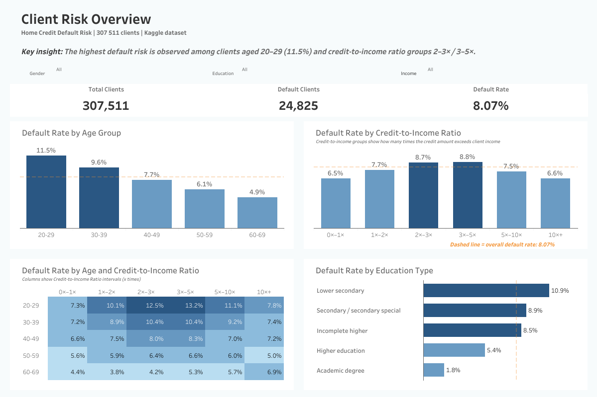
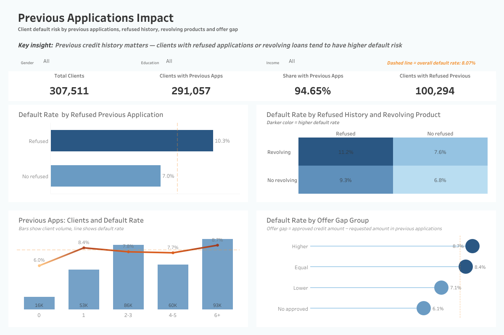

# Home Credit Default Risk Analysis


Client default risk analysis based on the Kaggle Home Credit Default Risk dataset.  
The project covers data preparation, EDA, SQL analysis, hypothesis testing, baseline modeling and Tableau dashboards.

## 📌 Project Overview

This project analyzes the **Home Credit Default Risk** dataset from Kaggle to identify client segments and previous application patterns associated with a higher probability of default.

The analysis follows a full analytical workflow: data preparation, exploratory data analysis, SQL-based aggregation, hypothesis testing, a baseline machine learning model and Tableau dashboards for business interpretation.

The main goal is not only to build a model, but also to understand which factors may indicate higher credit risk and how these insights can support risk segmentation.

---

## 🔗 Quick Links

- [Interactive Tableau Dashboard](https://public.tableau.com/app/profile/liudmyl.sibikovska/viz/home_credit_default_risk_dashboard/ClientsRiskOverview)
- [Python Notebooks](notebooks/)
- [SQL Queries](sql/)
- [Dashboard Screenshots](visuals/)

---

## 📊 Project Status

| Component | Status |
|---|---|
| Data preparation and feature engineering | ✅ Complete |
| Exploratory data analysis | ✅ Complete |
| Previous applications analysis | ✅ Complete |
| SQL analysis with DuckDB | ✅ Complete |
| Hypothesis testing | ✅ Complete |
| Baseline machine learning model | ✅ Complete |
| Tableau dashboards | ✅ Published |
| GitHub documentation | ✅ Complete |

---

## ⭐ Project Highlights

| Area | Result |
|---|---|
| Dataset size | 307,511 client applications |
| Overall default rate | 8.07% |
| Highest risk age segment | Clients aged 20–29 |
| Key financial signal | Credit-to-income ratio groups 2–3× and 3–5× |
| Previous application signal | Refused history and revolving products are associated with higher default risk |
| Final outputs | 5 notebooks, 3 SQL queries, 2 Tableau dashboards |

---

## 📁 Dataset

Dataset: **Home Credit Default Risk**  
Source: Kaggle

Main tables used in this project:

- `application_train.csv` — current loan applications and client characteristics;
- `previous_application.csv` — historical applications of the same clients.

Raw data is not uploaded to this repository due to dataset size and Kaggle usage rules.

---

## ❓ Key Analytical Questions

The project focuses on 10 analytical questions:

1. What is the overall default rate?
2. Which client segments have the highest default risk?
3. Is credit-to-income ratio related to default risk?
4. What is the distribution of previous application statuses?
5. Is previous application status associated with current default risk?
6. Which previous contract type has the highest default rate?
7. Is offer gap in previous applications related to current default risk?
8. How does default rate change across credit-to-income groups in SQL analysis?
9. Is the number of previous applications related to default risk?
10. Which combination of previous status and contract type has the highest default rate?

Additionally, the project includes a statistical hypothesis test and a simple baseline machine learning model.

---

## 🛠 Tools and Technologies

- **Python** — data preparation, EDA, hypothesis testing and baseline modeling;
- **pandas / numpy** — data manipulation;
- **matplotlib / seaborn** — exploratory visualizations;
- **DuckDB SQL** — analytical SQL queries inside Python notebooks;
- **statsmodels** — hypothesis testing;
- **scikit-learn** — baseline machine learning model;
- **Tableau Public** — interactive dashboards;
- **Git / GitHub** — project version control and documentation.

---

## 🗂 Project Structure

```text
home-credit-default-risk/
├── data/
│   ├── raw/
│   └── processed/
├── notebooks/
│   ├── 01_data_preparation.ipynb
│   ├── 02_eda_previous_applications.ipynb
│   ├── 03_sql_tableau_data.ipynb
│   ├── 04_hypothesis_and_modeling.ipynb
│   └── 05_key_insights_recommendations.ipynb
├── sql/
│   ├── q01_default_rate_by_credit_income_group.sql
│   ├── q02_default_rate_by_previous_applications_count.sql
│   └── q03_default_rate_by_previous_status_and_product_type.sql
├── visuals/
│   ├── client_risk_overview.png
│   └── previous_applications_impact.png
├── requirements.txt
├── README.md
└── .gitignore
```

---

## 📓 Notebooks

| Notebook | Purpose |
|---|---|
| `01_data_preparation.ipynb` | Data loading, structure review, cleaning and feature engineering |
| `02_eda_previous_applications.ipynb` | Exploratory analysis of client segments and previous applications |
| `03_sql_tableau_data.ipynb` | SQL analysis with DuckDB and preparation of Tableau datasets |
| `04_hypothesis_and_modeling.ipynb` | Hypothesis testing and baseline machine learning model |
| `05_key_insights_recommendations.ipynb` | Final insights, business interpretation and recommendations |

---

## 🧮 SQL Analysis

DuckDB SQL was used to validate key patterns and prepare aggregated views for Tableau.

Main SQL outputs:

| Analysis Area | Business Purpose |
|---|---|
| Credit-to-income groups | Compare default rate across financial load segments |
| Previous applications count | Check whether repeated previous applications are associated with higher risk |
| Previous status × product type | Identify risky combinations of previous application status and contract type |

SQL queries are stored in the `sql/` folder for readability and reproducibility.

---

## 📊 Tableau Dashboard

Interactive dashboard is available on Tableau Public:

[View interactive dashboard on Tableau Public](https://public.tableau.com/app/profile/liudmyl.sibikovska/viz/home_credit_default_risk_dashboard/ClientsRiskOverview)

The Tableau workbook contains two dashboards:

### 1. Client Risk Overview

This dashboard shows default risk by key client characteristics:

- age group;
- credit-to-income ratio;
- age × credit-to-income ratio combination;
- education type;
- gender, education and income filters.



### 2. Previous Applications Impact

This dashboard focuses on how previous credit history is related to current default risk:

- refused previous applications;
- previous revolving loan history;
- number of previous applications;
- offer gap in previous applications;
- combined risk view for refused history and revolving products.



---

## 🔍 Key Insights

- The overall default rate is **8.07%**.
- The highest default risk is observed among clients aged **20–29**.
- Medium credit-to-income ratio groups, especially **2–3×** and **3–5×**, show higher default risk.
- Clients with previous refused applications have a higher default rate than clients without refused history.
- Clients with previous revolving loan history also show higher default risk.
- The riskiest previous-application segment combines refused application history and revolving product history.
- Previous application behavior provides useful risk signals, but it should be combined with financial and demographic client-level indicators.
- The baseline machine learning model showed that selected features contain some predictive signal, but class imbalance remains a key limitation.
- Class imbalance (8.07% default rate) is a structural challenge: the baseline model tends to predict the majority class, which highlights the need for class balancing in future iterations.

---

## 🧪 Hypothesis Testing and Analytical Findings

The analysis tested whether selected client and previous-application factors are associated with default risk.

| Hypothesis / Factor | Key Comparison | Result | Interpretation |
|---|---:|---|---|
| Younger clients have higher default risk | Age 20–29: **11.5%** vs overall **8.07%** | Observed pattern | Younger clients show the highest observed default rate |
| Credit-to-income ratio is related to default risk | 2–3×: **8.7%**, 3–5×: **8.8%** vs overall **8.07%** | Observed pattern | Medium credit-to-income load is associated with higher risk |
| Previous refused applications indicate higher risk | Refused: **10.3%** vs no refused: **7.0%** | Statistically supported | Refused history is a strong additional risk signal |
| Previous revolving product history indicates higher risk | Has revolving loans: **9.5%** vs no revolving loans: **7.3%** | Observed pattern | Revolving loan history may indicate higher credit risk |
| Number of previous applications is related to default risk | 0 previous apps: **6.0%** vs 6+ apps: **8.7%** | Observed pattern | Higher previous application activity is associated with higher default risk |
| Offer gap may provide additional segmentation value | Higher approved amount: **8.1%** vs lower approved amount: **6.7%** | Exploratory / needs validation | The pattern is weak and should be used only as a secondary feature, not as a standalone risk signal |
| Combination of refused history and revolving product is riskier | Refused + revolving: **11.2%** | Observed pattern | Combined previous-application signals identify the riskiest segment |

These findings are used for risk segmentation and business interpretation, not as standalone credit scoring rules.

---

## 🤖 Baseline Machine Learning Model

A simple baseline machine learning model was built to test whether selected client-level and previous-application features can be used for default prediction.

The model is used as a baseline analytical step, not as a production-ready credit scoring model.

Main purpose:

- validate whether selected features contain predictive signal;
- create a simple benchmark for future model improvements;
- connect business analysis with basic machine learning.

---

## 💡 Business Recommendations

Based on the analysis, the following recommendations can be considered:

- Pay closer attention to younger clients, especially the **20–29** age group.
- Monitor clients with medium credit-to-income load, especially **2–3×** and **3–5×** groups.
- Use previous refused applications as an additional risk signal.
- Consider previous revolving loan history as a potential indicator of higher default risk.
- Combine client financial indicators with previous application behavior for better segmentation.
- Use dashboards to explore risk patterns by client segment before making business decisions.
- Consider periodic refresh of dashboard filters to align with current portfolio composition.

---

## 🚀 Next Steps

The following directions can extend and improve this analysis:

- Address class imbalance — apply SMOTE or class_weight='balanced' to improve recall for the minority class (default clients).
- Expand the feature set — add income type, region, employment sector, and interaction features between demographics and previous application history.
- Build a second model — benchmark Logistic Regression against LightGBM or Random Forest to measure the uplift from a more complex approach.
- Automate risk segmentation — schedule periodic refresh of Tableau dashboards to align with portfolio composition changes over time.
- Explore time-based patterns — if timestamps are available, analyze whether default risk shifts across application periods or economic cycles.

---

## ▶️ How to Run the Project

1. Clone the repository:

```bash
git clone https://github.com/Liudmyla-D/home-credit-default-risk.git
```

2. Install required libraries:

```bash
pip install -r requirements.txt
```

3. Download the **Home Credit Default Risk** dataset from Kaggle.

4. Place raw CSV files into:

```text
data/raw/
```

5. Run notebooks in order:

```text
01_data_preparation.ipynb
02_eda_previous_applications.ipynb
03_sql_tableau_data.ipynb
04_hypothesis_and_modeling.ipynb
05_key_insights_recommendations.ipynb
```

---

## 📝 Repository Notes

- Raw data files are not included in the repository.
- Processed data files are also excluded from Git tracking.
- Dashboard screenshots are stored in the `visuals/` folder.
- SQL queries are stored separately in the `sql/` folder for readability.

---

## 👤 Author

**Liudmyla Sibikovska**  
Data Analyst